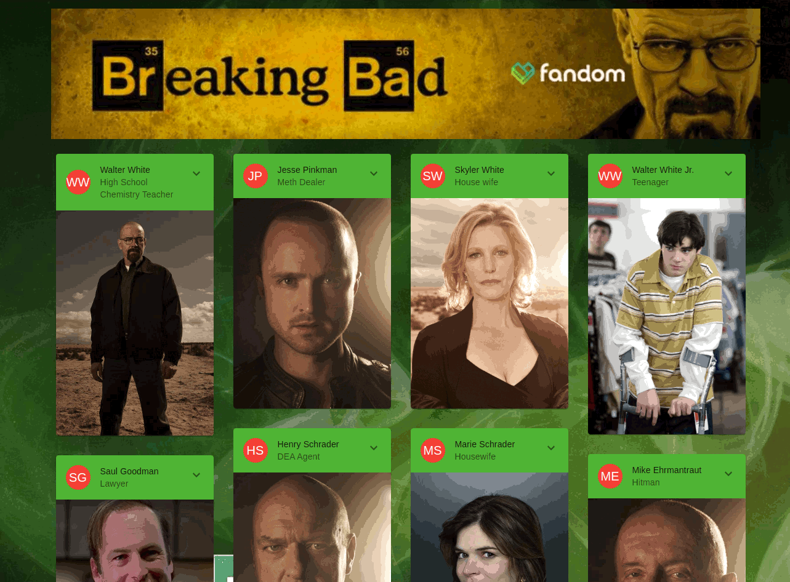

# Breaking Bad App

This app gives information about the actors of the Breaking Bad series.

I made this app to solidify learning Redux and ReactJS. I pulled data from API in an async logic using redux-thunk and used it.

Live demo via Surge.sh [Go Live](https://breaking-bad-wow.surge.sh/)

### Packages I use

* @mui/material
* tailwindcss
* react-redux
* @reduxjs/toolkit
* react-toastify
* axios

### Install

to install dependencies
> npm install

to run the program locally in the browser
> npm start

You can see the program at *http://localhost:3000/*

### Preview 

