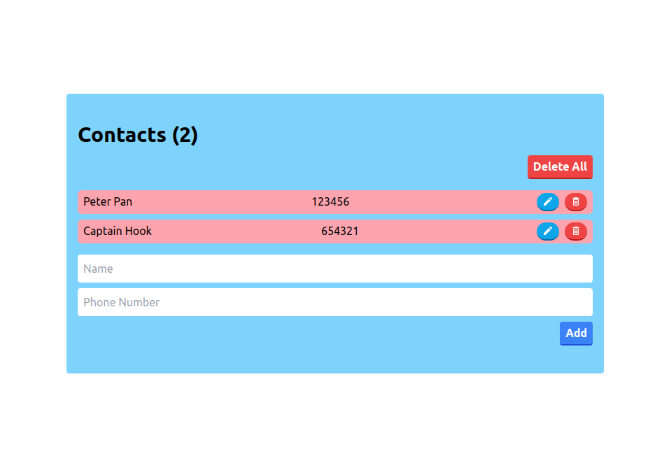

# Contacts App

A project to learn **Redux createEntityAdaptor** and data normalization

[Live Demo](https://shining-contacts.surge.sh/)

### Install

Go to relevant directory and install dependencies with..
> npm install

then run the project with..
> npm run start

### Preview 

