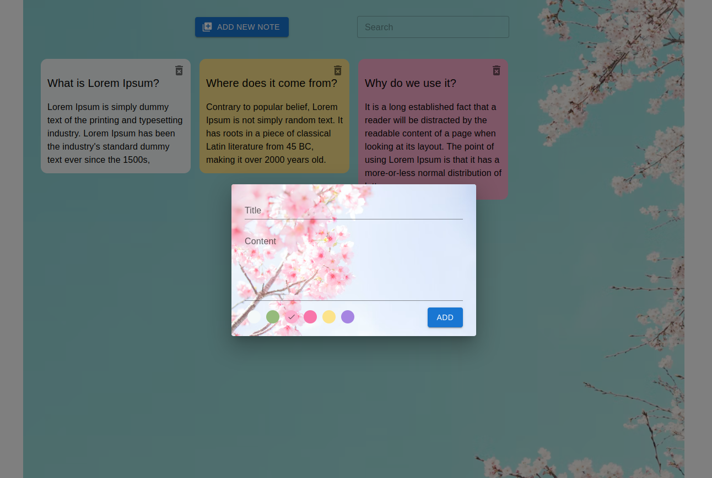

# Notes App

Note-taking application I made to solidify learning Redux. 

It performs note taking, deleting, changing background color and searching on existing notes via Redux states.

### Packages I use

* Material UI
* Tailwind Css
* React Redux
* Redux Toolkit

### Install

to install dependencies
> npm install

to run the program locally in the browser
> npm start

You can see the program at *http://localhost:3000/*

### Preview 

