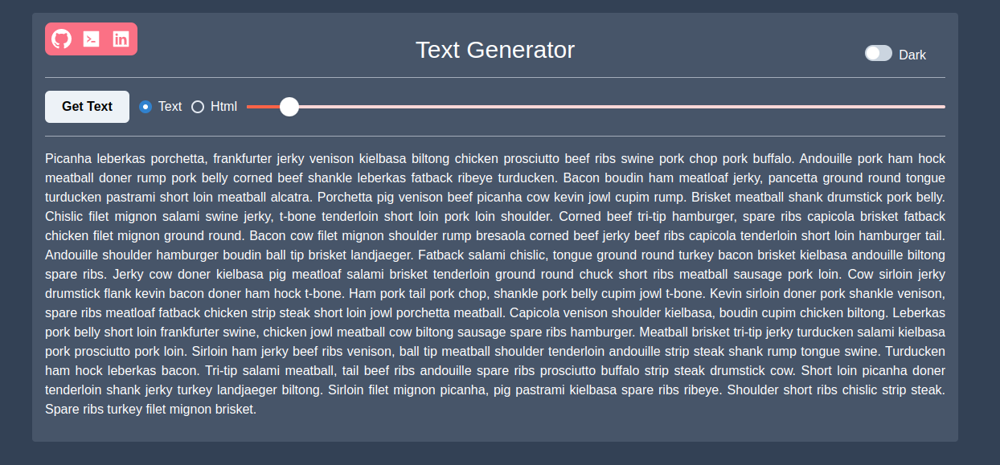

# Text Generator App

A simple lorem text-generating app. Made to learn basic app logic. Its pulling data from API using **Redux** and **Async Thunk**.

[Live Demo](https://text-generator-wow.surge.sh/)

## Packages I use...

* @chakra-ui/react
* @reduxjs/toolkit
* axios
* tailwindcss

## Install

---
Go to relevant directory and install dependencies with..
> npm install

then run the project with..
> npm run start

---
## Preview 
